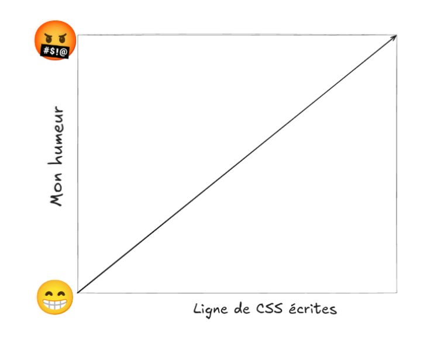

# Objectifs du rapport

Afin de démontrer ma compréhension du système, ce rapport présente les points suivants :

* **Analyse de l'architecture** : Évaluation des avantages et des désavantages du modèle découplé.
* **Étude comparative** : Comparaison avec d'autres types de systèmes pour mettre en relief ses spécificités.
* **Retour d'expérience** : Partage de mon expérience de développement et des leçons apprises.
* **Choix techniques** : Justification du système d'authentification retenu.
* **Défis et solutions** : Analyse des obstacles rencontrés lors du développement.
* **Évolution** : Présentation des améliorations futures envisagées pour le projet.

## Architecture

L’application **Study Bot** présente une architecture découplée classique. Pour le type d’application que j’ai construit, ce choix n’était probablement pas le plus adapté et, avec le recul, j’opterais pour une approche différente si c’était à refaire.  
Cependant, dans un contexte académique, cette architecture m’a permis d’expérimenter avec des technologies que je n’aurais pas choisies de moi-même et de relever plusieurs défis, ce qui m’a fait progresser en tant que développeur.

Avant d’aller plus loin, il est pertinent de lister les avantages et les désavantages d’une architecture découplée.

#### Avantages

- **Expérience utilisateur fluide** : Une fois l’application chargée dans le navigateur, on retrouve un ressenti proche d’une application mobile grâce au modèle SPA.
- **Évolutivité** : Le frontend pourrait être déployé sur un CDN et le backend "scaled" plus facilement.
- **Préparation pour le futur** : Il serait plus simple de lancer une application web ou mobile qui consomme la même API.
- **Spécialisation** : Bien que non applicable ici, ce type d’architecture permettrait de choisir un langage plus spécialisé pour le backend (comme Python ou Go).
- **Facilite le travail d’équipe** : Avantage non pertinent dans ce contexte, mais réel dans un projet collaboratif.

#### Désavantages

- **Complexité initiale** : On ajoute la responsabilité de synchroniser le backend et le frontend.
- **SEO** : Une SPA en React offre peu ou pas de référencement naturel sans solutions supplémentaires.
- **Vitesse de développement** : Le développement est plus lent qu’avec des frameworks plus intégrés comme Next.js ou Laravel.

D’un point de vue purement objectif, les avantages peuvent sembler l’emporter sur les désavantages.  
Cependant, dans notre cas d’utilisation précis, l’application n’a pas de réel besoin d’évolutivité, nous sommes encore très loin du développement d’une application mobile (seulement à la v0.1 de la version web), TypeScript et Express étaient imposés et le projet a été réalisé en solo.  

Si l’on retire ces avantages théoriques, il devient clair qu’une autre solution architecturale aurait pu être plus pertinente et plus rentable dans ce contexte précis.

Next.js propose une approche plus adapté selon moi. Voici une analyse de ses avantages et désavantages.

#### Avantages
- **SEO performant** : le "King" du SEO
- **Vitesse de développement** : Pas juste un peu, beaucoup plus rapide qu'avec une architecture découpler
- **Flexibilité du rendu** : Possibilité de mélanger pages statiques (Comme le landing page), sans compromettre l'expérience dynamique (Le chat).
- **Architecture plus simple** : Le frontend et le backend peuvent cohabiter dans le même projet, réduisant la complexité. Les types peuvent également être partager.

#### Désavantages
- **Couplage plus fort** : Réduit la liberté de déployer ou faire évoluer chaque partie indépendamment.
- **Moins adapté aux API réutilisables** : Si l’objectif principal est de construire une API consommée par plusieurs clients, une architecture découplée peut être plus pertinente.
- **Dépendance au framework** : Certaines décisions techniques sont imposées par Next.js, ce qui peut limiter la liberté architecturale à long terme.

En résumé, dans notre cas particulier avec une architechture découplé, on subit tous les désavantage sans jouir des avantages et avec Next.js c'est tous le contraire.

## Authentification

Pour le système d’authentification, j’ai choisi d’utiliser [Better Auth](https://www.better-auth.com/).

La raison principale derrière ce choix est que je souhaitais intégrer une **librairie d’authentification**, plutôt qu’un **service d’authentification**. Cette approche me donne plus de contrôle sur l’implémentation, mais surtout, dans un contexte académique, me permet de mieux comprendre le fonctionnement interne du mécanisme d’authentification.

Les différences princiale entre better-auth et clerk, par exemple, sont les suivante:


1. **Stateful** vs **Stateless** : Better Auth utilise un système de sessions *stateful*, contrairement à Clerk qui repose principalement sur des JWT, donc une approche *stateless*.

Avec une session, chaque requête nécessite une validation côté serveur : on vérifie dans la base de données si la session est valide, à quel utilisateur elle est associée et quelles sont ses permissions. Le serveur conserve donc un état.

Avec un JWT, le serveur ne garde aucune mémoire de la session. Le token est simplement déchiffré et toutes les informations nécessaires (identité de l’utilisateur, permissions, expiration) sont contenues directement dans le JWT et envoyées à chaque requête.

2. **Librairie** vs **Service** : Better Auth est une librairie open source que l’on intègre directement dans son application, alors que Clerk est un service externe.

Avec Better Auth, toute la logique d’authentification (sessions, utilisateurs, permissions) fait partie de l’application, le code roule sur notre serveur. Les données sont stockées dans la base de données du projet.

Avec Clerk, une grande partie de la logique et des données d’authentification est gérée par un service tiers. Cela permet une mise en place très rapide, mais implique une dépendance externe, moins de contrôle et un coût potentiel à long terme.

Je pense que les deux solutions sont tout à fait valable, mais je suis très content d'avoir utiliser better-auth comme ça ma permit de voir les deux systèmes au cours de la même session.

## Défi rencontrés

Je vais faire une réflexion sur cetraine chose que j'ai appris dans ce paragraphe. Plus que des défis, il y à surtout des choses que je ferais différament bien quelle soit fonctionnel et je pense qu'il serais intéressant de discuter de c'est points.

1. **Le système de types (TypeScript)** : TypeScript est un outil très puissant. À première vue, c’est *JavaScript avec des types*, et c’était exactement la vision que j’en avais lorsque j’ai fait mon backend. Au cours de la session, j’ai utilisé de plus en plus TypeScript et j’ai commencé à vraiment comprendre ses forces. Dans mon backend, il y a beaucoup de code qui se dédouble. Un exemple bête :

```typescript
res.status(200).json({
            success: true,
            message: "Stats retrieved successfully",
            data,
        });
```

Quand j’ai commencé à implémenter mon frontend, je me suis rendu compte que mes réponses n’étaient pas toujours du même format. Maintenant, j’utiliserais plutôt :

```typescript
type ApiResponse<T> {
    success: boolen
    message: string
    data: T | null
}
```

Même chose pour les requêtes entrantes. Durant le hackathon, j’ai utilisé Zod, une librairie de validation qui prend pleinement avantage de TypeScript. Si je refais une API en TypeScript, je vais impérativement utiliser cette librairie pour valider les requêtes entrantes plutôt que d’utiliser le « band-aid » que j’ai utilisé dans mon backend :

```typescript
declare global {
    namespace Express {
        interface Request {
            user?: User;
            session?: Session;
        }
    }
}

export interface AuthenticatedRequest extends Request {
    user: User;
    session: Session;
}
```

J’ai créé ces deux interfaces pour pouvoir ajouter l’utilisateur et la session à la Request Express de base. Ensuite, dans mes contrôleurs, j’utilisais AuthenticatedRequest pour dire au compilateur qu’il y a bel et bien un utilisateur et une session si on a passé le middleware d’authentification. Ça fonctionne, mais ce n’est pas élégant du tout.

Comme mon contrôleur ne prend pas une Request standard en argument, je dois caster en RequestHandler sur chaque callback.

```Typescript
router.get("/", getChatsForUser as RequestHandler);
export const updateChat = async (req: AuthenticatedRequest, res: Response) 
```

Ceci n’est qu’un exemple. Au début, j’avais l’impression de me battre contre TypeScript, maintenant, j’ai l’impression de l’utiliser.

2. **Les tests** : Pour mon backend, j’ai fait une suite de tests automatisés. Règle générale, en Go ou en PHP, je suis fan de TDD, ça fonctionne bien. Ici, j’ai eu du mal à m’enligner sur les tests. Pas nécessairement sur les tests en tant que tels, mais plus sur le système autour des tests.

Par example cette abomination: 

```Typescript
export function createMockRequest(options: {
    body?: any;
    params?: any;
    query?: any;
    headers?: any;
    method?: string;
    url?: string;
} = {}): Request {
    return {
        body: options.body || {},
        params: options.params || {},
        query: options.query || {},
        headers: options.headers || {},
        method: options.method || 'GET',
        url: options.url || '/',
        get: (name: string) => {
            const headers = options.headers || {};
            return headers[name.toLowerCase()];
        },
    } as Request;
}
```

J’étais simplement incapable d’utiliser les Request Express directement dans mes tests. C’est la seule façon que j’ai trouvée pour dire au compilateur : « laisse-moi faire ». C’est dirty, mais ça a fini par fonctionner.

Sinon, il y a l’histoire de la base de données. Pour effectuer mes tests, j’ai utilisé une branche de tests. Avant chaque test, je nettoyais la branche avec :

```typescript
beforeEach(async () => {
        await prisma.user.deleteMany();
        await prisma.session.deleteMany();
        await prisma.account.deleteMany();
        await prisma.verification.deleteMany();
        await prisma.message.deleteMany();
        await prisma.tokenUsage.deleteMany();
        await prisma.chat.deleteMany();
    });
```
Normalement, ça fonctionne sans problème, mais avec Prisma, les latences des requêtes montaient jusqu’à 2 secondes. Entre-temps, les autres tests s’exécutaient et le beforeEach() effaçait les données mid-test, ce qui créait constamment des conditions de course.

Au début, j’ai essayé de mettre un délai avant chaque test, mais parfois la latence dépassait une seconde. J’ai donc fini par simplement exécuter les tests en séquentiel.

```typescirpt
fileParallelism: false,
```

3. **React**: La partie React à été très bien. J'ai utiliser shadcn ui qui est un must pour moi. Voici un graphique de moi en relation au lignes de CSS écritre:


Le principale accrochage que j'ai eu à été au niveau du context. C'est à dire, la "sidebar" de mon applications utilise la liste des chats pour permettre au utilsateur de naviguer d'un chat à l'autre:

```typescript
{chats.map((chat: Chat) => (
    <SidebarMenuItem key={chat.id}>
        <SidebarMenuButton asChild>
            <Link to={`/dashboard/${chat.id}`}>
                <p>{chat.title}</p>
            </Link>
        </SidebarMenuButton>
        <SidebarMenuAction
            showOnHover
            className="text-destructive hover:text-destructive/80"
            onClick={() => { deleteChat(chat.id) }}
        >
            <Trash2 className="size-3.5" />
        </SidebarMenuAction>
    </SidebarMenuItem>
))}
```

Début j'allais chercher les chats avec un hook dans mon dashboard et je passais le `SetChat` à la composante responsable de créer un nouveau chat pour qu'elle mette la liste à jours. Le problème est survenue lorsque le Dashboard(La ou on chat) n'étais plus le seul à utiliser la side bar (le Profile).

Je ne savais vraiment pas ou appeler mon hook et comment syncroniser les chats. J'ai fini par trouver le `UseOutletContext` qui était vraiment idéal dans ce scénario.

J'ai créer un `DashboardLayout` qui appel les hook partager et les expose avec le OutletContext

```typescript
export type DashboardOutletContext = {
    chats: Chat[];
    setChats: (chats: Chat[]) => void;
    user: User | null;
    refetchUser: () => void;
};

...
return (
        <SidebarLayout
            chats={chats}
            setChats={setChats}
            user={user}
            error={userError}
            onPurchaseToken={handlePurchaseToken}
        >
            <Outlet context={{ chats, setChats, user, refetchUser } as DashboardOutletContext} />
        </SidebarLayout>
    );
```

Donc on injecte des dépandance la sidebar. Et ensuite :

```typescript
export function Dashboard() {
    ...
    const { chats, setChats, refetchUser } = useOutletContext<DashboardOutletContext>();
    ...
```

Dans le dashboard qui utilise ce layout on peu récupérer le contexte dans refetch les données!
J'ai franchement aimer travailler avec réact. J'ai beaucoup plus de facilité à résonner dans des environement stateless comme des API et j'ai bien aimer travailler avec la gestion d'état en React.

## Améliorations futures

Dison que la liste est longue... Je vois ce projet plus comme un prototype ou une expérimentation. Pour me prêter au jeu, je vais dresser une liste des améliorations que j'apporterais à ce projet mais réalistiquement je recommencerais avec Laravel plustot que te continuer ce projet. 

Amélioration futures:
- Plus de modèles (différent provider)
- Finaliser le système de payment.
- Gros travail sur le "behaviour" du modèle. Il est un peu redondant.
- Système de token plus intelligent.


